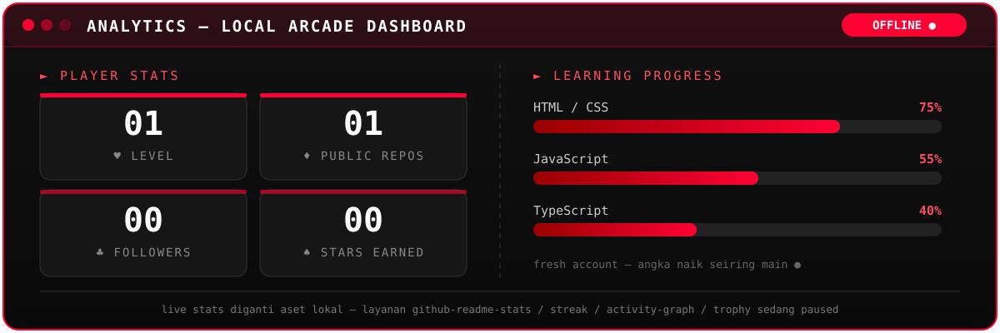
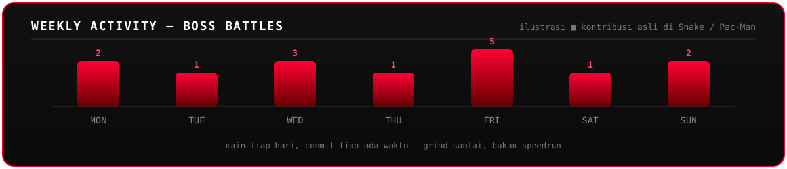
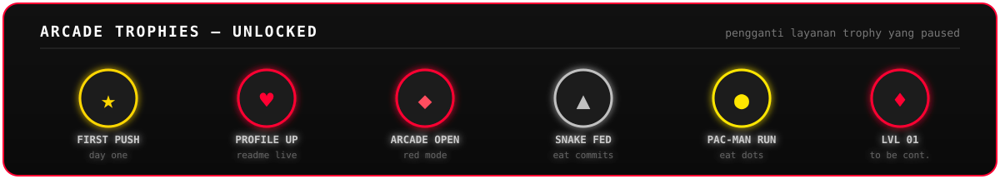
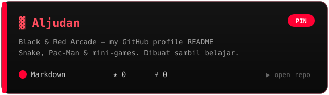

<!-- ═══════════════════════════════════════════════════════ -->
<!--  ALJUDAN — BLACK & RED ARCADE 🔴 — v9 LOCAL ASSETS      -->
<!--  Header, typing, dashboard, activity, repo & footer     -->
<!--  digambar lokal di assets/ (tanpa layanan yg paused)   -->
<!-- ═══════════════════════════════════════════════════════ -->



<p align="center">
  
</p>

<p align="center">
  
  
  
</p>

<p align="center">
  
  
</p>

<p align="center">
  <sub>⚠️ <i>Stack di bawah cuma buat estetik biar padet 🔴 — masih belajar, bukan ngaku jago 🙏</i></sub>
</p>

<br/>

<!-- ═══════════════ WHOAMI + STATS ═══════════════ -->

<table width="100%">
<tr>
<td width="55%" valign="top">

### `> whoami`

```javascript
const aljudan = {
  name: "Aljudan",
  location: "Bandung, ID 🇮🇩",
  role: "Learner • Gamer • Explorer",
  repos: ["Aljudan", "...more coming soon"],
  mode: "Black & Red Arcade 🔴",
  motto: "Beautify till you master it",
};
```

</td>
<td width="45%" valign="top">

### `> player_stats`

```text
♥ LIVES     ∞ UNLIMITED
♦ REPOS     3 Active
♣ QUEST     Learn by playing
♠ MODE      RED ARCADE

HTML/CSS   ████████░░ 75%
JS         ██████░░░░ 55%
TypeScript ████░░░░░░ 40%
```

</td>
</tr>
</table>

<br/>

<!-- ═══════════════ TECH STACK ═══════════════ -->

### `> tech_stack` — 🎨 display only

<p align="center"><sub>ikon di bawah cuma biar rame — <b>bukan flexing</b> 🙏</sub></p>

<p align="center">
  
</p>

<p align="center">
  
  
  
  
</p>

<br/>

<!-- ═══════════════ ARCADE ZONE ═══════════════ -->

### `> arcade_zone` — 🔴 GAMES

<p align="center">
  
  <br/>
  <sub>Snake & Pac-Man dibuat otomatis dari kontribusi GitHub kamu (workflow: <code>Arcade Games</code>)</sub>
</p>

#### 🐍 SNAKE — EAT COMMITS

<picture>
  <source media="(prefers-color-scheme: dark)" srcset="https://raw.githubusercontent.com/Aljudan/Aljudan/output/github-contribution-grid-snake-dark.svg"/>
  <source media="(prefers-color-scheme: light)" srcset="https://raw.githubusercontent.com/Aljudan/Aljudan/output/github-contribution-grid-snake.svg"/>
  
</picture>

#### 👻 PAC-MAN — EAT DOTS

<picture>
  <source media="(prefers-color-scheme: dark)" srcset="https://raw.githubusercontent.com/Aljudan/Aljudan/output/pacman-contribution-graph-dark.svg"/>
  <source media="(prefers-color-scheme: light)" srcset="https://raw.githubusercontent.com/Aljudan/Aljudan/output/pacman-contribution-graph.svg"/>
  
</picture>

<table width="100%">
<tr>
<td width="50%" align="center" valign="top">

#### ❌⭕ TIC-TAC-TOE

```text
 X │ O │ X
───┼───┼───
 O │ X │ O
───┼───┼───
 X │ O │ X
```


</td>
<td width="50%" align="center" valign="top">

#### ♟️ CHESS

```text
♜ ♞ ♝ ♛ ♚ ♝ ♞ ♜
♟ ♟ ♟ ♟ ♟ ♟ ♟ ♟
♙ ♙ ♙ ♙ ♙ ♙ ♙ ♙
♖ ♘ ♗ ♕ ♔ ♗ ♘ ♖
```


</td>
</tr>
</table>

<br/>

<!-- ═══════════════ MUSIC ZONE ═══════════════ -->

### `> music_zone` — 🎧 ARCADE FM

<p align="center">
  <a href="https://open.spotify.com/playlist/37i9dQZF1DX0XUsuxWHRQd" target="_blank">
    
  </a>
  
</p>

<br/>

<!-- ═══════════════ ANALYTICS (LOCAL) ═══════════════ -->

### `> analytics` — 📊 LOCAL DASHBOARD

<p align="center"><sub>widget live (<code>github-readme-stats</code>, <code>streak</code>, <code>activity-graph</code>, <code>trophy</code>) lagi paused — diganti dasbor lokal biar profil tetap nyala 🔴</sub></p>

<p align="center">
  
</p>

<p align="center">
  
</p>

<p align="center">
  
</p>

<br/>

<!-- ═══════════════ SHOWCASE ═══════════════ -->

### `> showcase` — 📌 FEATURED

<p align="center">
<a href="https://github.com/Aljudan/Aljudan">
  
</a>
</p>

<p align="center">
  
  <br/><sub>repo lainnya masih private — <i>coming soon</i> 🔴</sub>
</p>

<p align="center">
  
</p>

<br/>

<!-- ═══════════════ CONNECT ═══════════════ -->

### `> connect`

<p align="center"><sub>mampir & main bareng 🙏</sub></p>

<p align="center">
  <a href="https://github.com/Aljudan">
    
  </a>
  <a href="https://instagram.com/aljudan">
    
  </a>
</p>


<p align="center"><sub>© 2026 Aljudan — <i>"Play more, learn more."</i> 🔴🎮</sub></p>

<details>
<summary>⚙️ Snake / Pac-Man masih kosong? Klik di sini (cukup 1x)</summary>

Workflow-nya sudah ada di <code>.github/workflows/arcade.yml</code>. Tinggal:

1. Buka tab **Actions** di repo `Aljudan/Aljudan`
2. Pilih **Arcade Games** → klik **Run workflow**
3. Tunggu ± 2 menit sampai hijau ✅
4. Refresh halaman profil kamu — Snake & Pac-Man langsung muncul 🐍👻

Setelah itu otomatis update tiap 12 jam & tiap push ke `main`.

</details>
