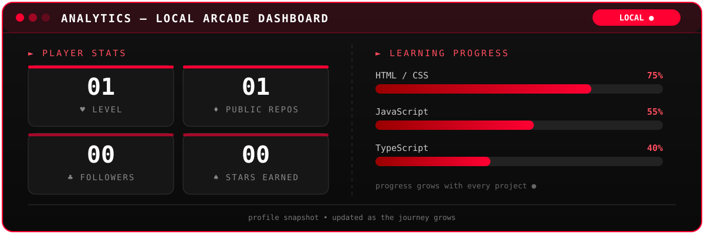
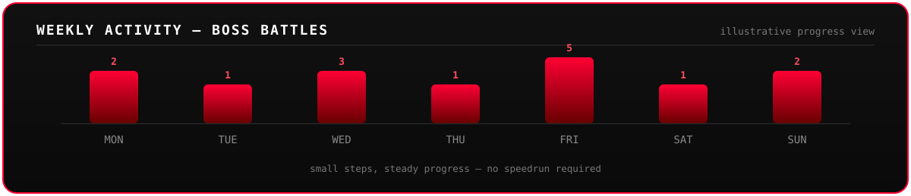
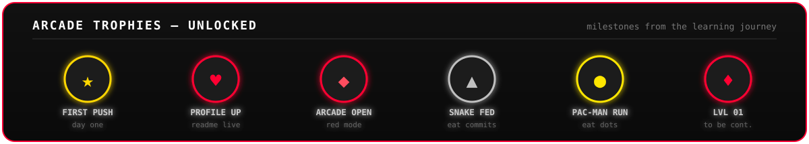
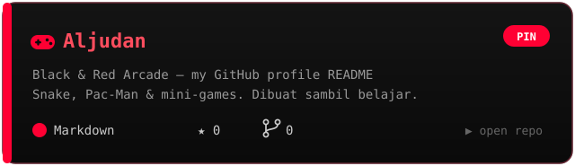

<!-- Aljudan · GitHub profile README -->

<p align="center">
  
</p>

<p align="center">
  <strong>Frontend learner · Creative builder · Lifelong gamer</strong><br />
  Building small things, learning in public, and making every project a little better.
</p>

<p align="center">
  <a href="https://github.com/Aljudan"></a>
  <a href="https://instagram.com/aljudan"></a>
</p>

<p align="center">
  
  
</p>

<br />

## `> whoami`

<table width="100%">
<tr>
<td width="55%" valign="top">

Hi, I'm **Aljudan**, a developer from **Bandung, Indonesia** 🇮🇩.

I'm currently exploring frontend development and turning ideas into clean, useful, and enjoyable interfaces. This profile is my little arcade: every repository is a new level, every bug is a puzzle, and every commit is progress.

- 🔭 Building: small web projects and experiments
- 🌱 Learning: JavaScript, TypeScript, React, and modern UI
- 🎮 I enjoy: games, visual design, and trying new tools
- 💬 Motto: **build, learn, repeat**

</td>
<td width="45%" valign="top">

### `> current_loadout`

```text
ROLE       Frontend learner
LOCATION   Bandung, Indonesia
STATUS     Learning in public
FOCUS      Web & creative interfaces
PLAYSTYLE  Curious · Consistent · Practical
```

</td>
</tr>
</table>

## `> tech_stack`

<p align="center">
  
</p>

<p align="center">
  <sub>Tools I use, explore, or am actively learning — not a list of finished quests.</sub>
</p>

## `> activity_log`

<p align="center">
  
</p>

<p align="center">
  
</p>

<p align="center">
  
</p>

## `> arcade_mode`

<p align="center">
  
</p>

<p align="center">
  <sub>Contribution games are generated automatically by GitHub Actions. Keep committing to keep the arcade alive.</sub>
</p>

<picture>
  <source media="(prefers-color-scheme: dark)" srcset="https://raw.githubusercontent.com/Aljudan/Aljudan/output/github-contribution-grid-snake-dark.svg" />
  <source media="(prefers-color-scheme: light)" srcset="https://raw.githubusercontent.com/Aljudan/Aljudan/output/github-contribution-grid-snake.svg" />
  
</picture>

## `> featured_level`

<p align="center">
  <a href="https://github.com/Aljudan/Aljudan">
    
  </a>
</p>

<p align="center">
  <sub>More levels are in development. Check back soon for new projects.</sub>
</p>

## `> connect`

<p align="center">
  If you like what you see, feel free to explore the repositories or say hello.
</p>

<p align="center">
  <a href="https://github.com/Aljudan"></a>
  <a href="https://instagram.com/aljudan"></a>
</p>


<p align="center"><sub>© 2026 Aljudan · <i>Build, learn, repeat.</i> 🔴</sub></p>
